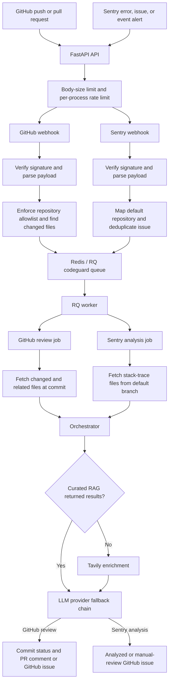

# Architecture

## Runtime overview

CodeGuard exposes two FastAPI webhook endpoints and processes accepted work
asynchronously on the `codeguard` Redis/RQ queue. The API validates and
normalizes requests; the worker retrieves repository content, runs analysis,
and publishes human-reviewable output to GitHub.

The Sentry endpoint currently maps every accepted event to
`CODEGUARD_DEFAULT_OWNER` and `CODEGUARD_DEFAULT_REPO`. Unlike the GitHub
endpoint, it does not yet enforce the repository allowlist before Redis and
queue operations. The worker-side `GitHubClient` still validates the mapped
repository, but webhook-side enforcement remains required hardening.

## Components

| Area | Responsibility |
|---|---|
| `src/api/main.py` | FastAPI application, middleware registration, webhook router, and health endpoint |
| `src/api/webhook_security.py` | Webhook body-size limit and in-process, client-address rate limit |
| `src/api/webhook.py` | Compatibility router that composes the domain-specific webhook routers |
| `src/api/github_webhook.py` | GitHub HMAC verification, event parsing, repository allowlist, PR file discovery, and enqueueing |
| `src/api/sentry_webhook.py` | Sentry verification, supported-resource filtering, default-repository mapping, Redis deduplication, and enqueueing |
| `src/agents/sentry_agent.py` | Sentry HMAC verification and error extraction from supported payload shapes |
| `src/worker/redis_connection.py` | Redis URL policy, bounded connection retry, and queue factory |
| `src/worker/worker.py` | GitHub review and Sentry analysis jobs plus RQ worker bootstrap |
| `src/github` | Shared GitHub HTTP client, repository policy, API operations, validation, and retry |
| `src/context` | Repository-path filtering, GitHub content retrieval, and import-based related-file discovery |
| `src/orchestration` | Prompt construction, RAG/Tavily selection, LLM provider fallback, and `BugAnalysis` validation |
| `src/rag` | Optional read-only runtime retrieval plus explicit local indexing and synchronization tools |
| `src/utils` | Formatting for PR comments and analyzed or fallback bug issues |

## GitHub review path

1. Middleware applies the webhook body-size limit and per-process rate limit.
2. The endpoint verifies the GitHub HMAC SHA-256 signature and parses JSON.
3. It extracts and validates repository identity, then enforces the repository
   allowlist.
4. For a push, changed paths come from commit data. For an opened or
   synchronized pull request, the endpoint fetches changed files from GitHub
   using bounded pagination.
5. If files exist, it enqueues `process_github_review()` with the commit, branch,
   changed paths, and optional pull-request metadata.
6. The worker publishes a pending commit status, filters supported paths, and
   fetches changed and related files at the requested commit.
7. The orchestrator tries curated RAG first. If RAG is disabled, empty, or
   unavailable, it requests relevant Tavily references.
8. The worker derives the final commit status from the review. It posts a PR
   comment when a PR is known or discoverable; otherwise it creates a GitHub
   issue.

If no analyzable files remain after filtering, the worker marks the commit
successful and does not invoke the LLM.

## Sentry analysis path

1. Middleware applies the same webhook body-size and rate limits.
2. The endpoint verifies `Sentry-Hook-Signature` against the raw request body,
   parses JSON, and accepts only `error`, `issue`, and `event_alert` resources.
3. `SentryAgent` normalizes the supported payload shapes into error metadata and
   stack-trace repository paths.
4. The endpoint maps the event to the configured default GitHub repository. If
   an issue ID exists, Redis acquires a short-lived pending deduplication key
   before enqueueing and replaces it with a 24-hour queued marker afterward.
5. It enqueues `process_sentry_job()`. The worker resolves the repository's
   default branch and retrieves analyzable stack-trace files plus related files.
6. The orchestrator uses RAG or Tavily enrichment and requests JSON from the same
   provider chain. Each response must validate as `BugAnalysis`; invalid output
   advances to the next provider.
7. A valid analysis becomes a GitHub issue labeled `bug` and `ai-analyzed`. If
   every provider fails, the worker creates a minimal issue labeled `bug` and
   `needs-manual-review`.

If no analyzable stack-trace files are available, the worker ends without
creating an issue.

## Failure boundaries

- Oversized or locally rate-limited webhook requests fail before endpoint
  processing.
- Invalid signatures and malformed payloads fail before jobs are accepted.
- GitHub webhook repository policy is fail-closed: a missing allowlist returns
  an error and an unauthorized repository is rejected.
- Sentry webhook repository allowlist enforcement before Redis remains pending;
  the mapped repository is validated later by `GitHubClient` in the worker.
- GitHub and Redis transient failures use bounded retry where implemented.
- RAG and Tavily are enrichment only; their failure does not stop core analysis.
- LLM providers fail over in order. Total review failure produces an error
  status and controlled review text; total structured Sentry failure produces a
  manual-review issue.
- A GitHub worker exception attempts to set an error commit status and is then
  re-raised for RQ to record.
- CodeGuard never commits source changes automatically; comments, statuses, and
  issues remain subject to human review.
